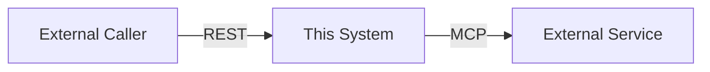

# L2: System Architecture Document
**SDDF Layer:** L2 — How the system is shaped
**Owner:** Staff / Principal Engineers
**Sent to agents:** Relevant sections only
**Template version:** 0.4.0

> This document defines system shape before feature work begins.
> Updated when architectural decisions change — not when features are added.
> Complete the Agent Architecture Addendum for autonomous/pipeline systems.
> Mark APPROVED before any L4 task specs are written.

**Status:** [ ] DRAFT  [ ] IN REVIEW  [ ] APPROVED
**Approved by:** _______________  **Last updated:** _______________

---
## System: [Name]

---
## System Boundary
[What this system owns vs. delegates]

### Context Diagram


---
## Service / Module Inventory

| Module | Location | Responsibility | Key Exports | Depends On |
|---|---|---|---|---|

---
## Integration Points

| External System | Protocol | Direction | Auth | Rate Limit | Freshness | On Failure |
|---|---|---|---|---|---|---|

---
## Technology Stack

| Concern | Choice | Version | Rationale |
|---|---|---|---|
| Language | | | |
| Framework | | | |
| Test framework | | | |
| Database | | | |
| Deployment | | | |

---
## Data Model
```typescript
interface [EntityName] {
  id: string;
  // key fields
  createdAt: string;
  updatedAt: string;
}
```

---
## Approved Patterns

| Pattern | Pattern Library Reference | Where Used |
|---|---|---|

---
## Architectural Constraints
- MUST NOT: [constraint]
- MUST NOT: [constraint]
- SHOULD NOT: [softer constraint]

---
## Known Technical Debt

| Item | Location | Why | Plan | Impact on Task Specs |
|---|---|---|---|---|

---
## Brownfield Notes *(skip for greenfield)*

### Legacy Patterns to Avoid
- [Pattern] in [location] — DO NOT replicate. Use [better pattern] instead.

### Backward Compatibility Requirements
[What must not break, and for how long]

---
## Agent Architecture Addendum
*(Complete for autonomous-agent and workflow-pipeline types only)*

### System Type
[ ] Autonomous Agent  [ ] Workflow Pipeline  [ ] Hybrid  [ ] N/A

### Trigger Conditions
| Trigger | Mechanism | Frequency / Condition |
|---|---|---|

### Tool Access
| Tool / API | Protocol | Permission | Purpose | Rate Limit |
|---|---|---|---|---|

### Decision Boundaries
| Decision | Autonomous? | Approval From | Escalation Path |
|---|---|---|---|

### Failure Modes
| Failure | Detection | Agent Response | Human Alert? |
|---|---|---|---|

### Observability
Decision audit log: `{ timestamp, trigger, inputs, decision, action, outcome }`
Retention: ___  Location: ___

Metrics:
| Metric | Type | Alert Threshold |
|---|---|---|

Shadow Mode required: [ ] Yes (duration: ___)  [ ] No

---
## Changelog

| Date | Change | Author | Impact |
|---|---|---|---|

---
*L2 System Architecture Document | SDDF v0.4.0*
